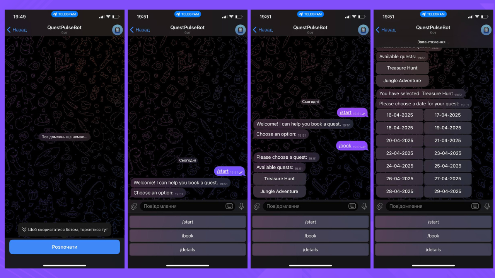
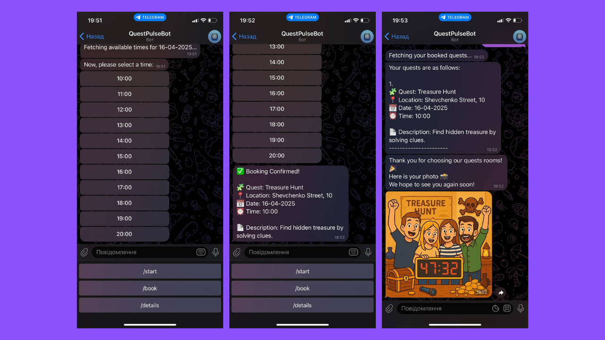

# Quest Pulse 🧩

A Telegram-based quest booking platform built with **Spring Boot**, **RabbitMQ**, **PostgreSQL**, and **AWS S3 (MinIO)**. Participants can browse quests, book time slots, and receive photos after completing quests — all within Telegram.

## Tech Stack
- **Java 21**
- **Spring Boot**
- **Spring Web (REST)**
- **Spring Data JPA**
- **RabbitMQ**
- **PostgreSQL**
- **Flyway** (Database Migrations)
- **AWS S3** (MinIO)
- **SLF4J & Logback** (Logging)
- **Telegram Bot API**
- **Docker & Docker Compose**


## Features

- Telegram bot interface:
  - Browse available quests
  - View free time slots for a specific quest
  - Book a quest for a selected time
  - Review all active bookings
  - Users receive a notification via the Telegram bot with their photo after completing the quest.
- After a participant completes a quest, their photo is uploaded via REST API to AWS S3 (MinIO)
- **View uploaded photos** via MinIO dashboard:  
  🔗 [http://localhost:9001](http://localhost:9001)


### 🧠 Booking Flow (How it works)

1. User interacts with Telegram bot (e.g., `/start`, `/book`, `/details`)
2. Bot sends request to `quest-service` via RabbitMQ
3. `quest-service` returns available quests and times
4. User selects quest, date, and time
5. Booking is stored in PostgreSQL
6. Admin uploads photo using `/api/uploads`
7. `photo-service` uploads photo to S3 and sends it via RabbitMQ
8. The Telegram bot receives the photo and sends it directly to the user, along with a thank-you message.


### 🤖 Telegram Bot in Action



---


## Getting Started

### Telegram Bot Setup
Create a bot using @BotFather, get the token, and add the following to your .env file:
```
TELEGRAM_BOT_USERNAME=QuestPulseBot
TELEGRAM_BOT_TOKEN=your_token_here
```

### Clone the Repository

First, clone the repository to your local machine

### Environment Configuration
Create a .env file in the root of the project with the following configuration:

```
# Telegram Bot
TELEGRAM_BOT_USERNAME=QuestPulseBot
TELEGRAM_BOT_TOKEN=your_token_here

# RabbitMQ
RABBITMQ_USERNAME=guest
RABBITMQ_PASSWORD=guest

# AWS (MinIO)
AWS_ACCESS_KEY=minioadmin
AWS_SECRET_KEY=minioadmin
S3_BUCKET_NAME=photo-quests

# PostgreSQL
POSTGRES_DB_DATABASE=quest-pulse-db
POSTGRES_DB_USERNAME=postgres
POSTGRES_DB_PASSWORD=1234

# Flyway
FLYWAY_USER=postgres
FLYWAY_PASSWORD=1234
```

## 🐳 Docker Compose Setup

The project uses **Docker Compose** to manage multiple services, including the **bot-service, photo-service, quest-service, RabbitMQ, Minio, and postgres**. The `docker-compose.yml` file defines the setup for each service.

### Running the Application

To start all microservices, use the following command:

```bash
docker-compose up --build -d
```

### Services:
- **bot-service**: Handles user interactions with the quest booking process via [YourBotName] Telegram bot.
- **photo-service**: Photos are uploaded to AWS S3 (MinIO).
- **quest-service**: Business logic and DB
- **postgres**: Stores quest and booking data.
- **RabbitMQ**: Message broker for event-driven communication.
- **Minio**: Object storage for photo uploads and retrieval.

---


## API Endpoints

### Upload a participant photo

**POST** `/api/uploads`

**Request body:**

- Multipart file: attach as file
```json
{
  "questCode": "TREASURE_HUNT",
  "date": "2025-04-16",
  "time": "10:00"
}
```

**Response:**

```
Photo uploaded to path: TREASURE_HUNT/2025-04-16/10:00.jpg
```
or
```
Validation failed: Date is required; Quest code is required
```


## Author

Mykola Lytvynov
